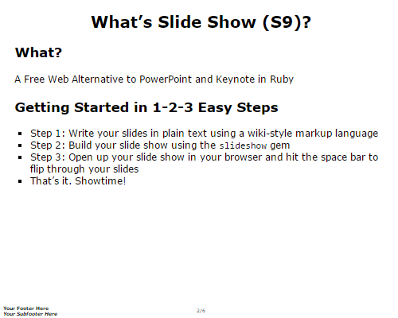

# S6 Blank - Slideshow (S9) Template Pack

## Live Preview

See [`slides.html`](http://slideshow-templates.github.io/slideshow-s6-blank/slides.html)
and [`slides.pdf.html`](http://slideshow-templates.github.io/slideshow-s6-blank/slides.pdf.html).

## What's Slideshow (S9)?

A free command line tool (and library)
that lets you build slideshows from your notes written in plain text with markdown formatting conventions. More [Slideshow (S9) Project Site »](http://slideshow-s9.github.io)

## Intro

The [S6 Blank](https://github.com/slidekit/s6) package bundled up into
a Slideshow (S9) template pack.

## Try It Yourself - How To Use the Template Pack

If you want to try it yourself, install (fetch) the new template pack. Type the command:

    $ slideshow install s6blank

Or as an alternative clone the template pack using `git`. Type the commands:

    $ cd ~/.slideshow/templates
    $ git clone https://github.com/slideshow-templates/slideshow-s6-blank

To check if the new template got installed, use the `list` command:

    $ slideshow list

Listing something like:

    Installed templates include:
       s6blank.txt (~/.slideshow/templates/s6blank/s6blank.txt)

Now you're ready to use it using the `-t/--template` switch. Example:

    $ slideshow build tutorial.txt -t s6blank

That's it.

## Questions? Comments?

Send them along to the [wwwmake forum/mailing list](http://groups.google.com/group/wwwmake).
Thanks!
